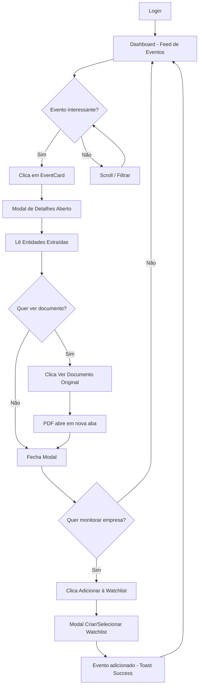
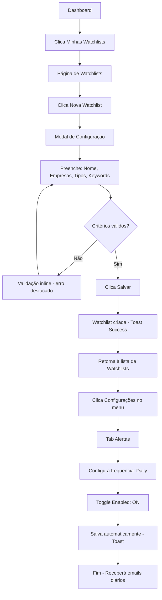
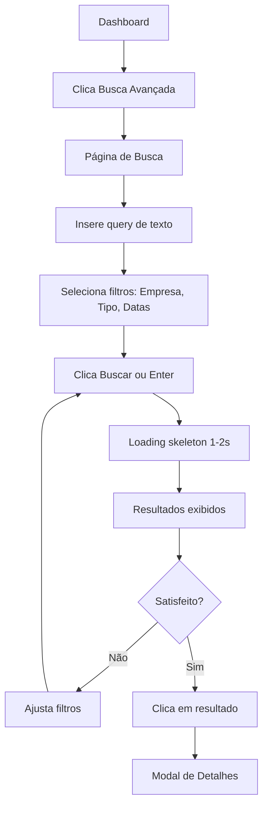

# AtlasReg - UI/UX Specification

**Versão:** 1.0  
**Data:** 17 de Outubro de 2025  
**Preparado por:** Sally (UX Expert - BMad Method)

---

## Introduction

Este documento define os objetivos de experiência do usuário, arquitetura de informação, fluxos de usuário, e especificações de design visual para a interface do **AtlasReg**. Serve como fundação para desenvolvimento frontend, garantindo experiência coesa e centrada no usuário.

### Overall UX Goals & Principles

#### Target User Personas

**Power User - Analista de Inteligência de Mercado**
- Profissional técnico, 28-45 anos, trabalha em transmissoras de energia ou fundos de infraestrutura
- Usa o sistema 3-5x por dia, precisa de eficiência e informações densas
- Familiarizado com ferramentas de BI e dashboards analíticos
- Valoriza: velocidade, precisão, customização (watchlists), alertas configuráveis

**Decision Maker - Diretor/VP de M&A ou Relações Institucionais**
- Executivo sênior, 40-60 anos, consome informações para decisões estratégicas
- Usa o sistema 1-2x por semana, principalmente via alertas por email
- Precisa de visualizações high-level, tendências, eventos críticos destacados
- Valoriza: clareza, insights acionáveis, relatórios executivos

#### Usability Goals

- **Eficiência para Power Users:** Tarefas frequentes (buscar eventos, configurar watchlist) completáveis em <3 cliques
- **Clareza para Decision Makers:** Informações críticas visíveis imediatamente no dashboard sem scroll
- **Descoberta Rápida:** Novos usuários conseguem encontrar evento relevante e entender detalhes em <2 minutos
- **Prevenção de Erro:** Ações destrutivas (deletar watchlist) requerem confirmação explícita
- **Feedback Imediato:** Toda ação (salvar, buscar, filtrar) tem resposta visual em <300ms

#### Design Principles

1. **Densidade Informacional Controlada** - Dashboard mostra muita informação, mas organizada hierarquicamente sem causar sobrecarga cognitiva
2. **Dark-First Profissional** - Interface escura reduz fadiga visual durante uso prolongado e transmite seriedade/confiabilidade
3. **Ações Contextuais** - Botões e controles aparecem onde o usuário precisa (hover em EventCard mostra "Adicionar à Watchlist")
4. **Consistência de Padrões** - Mesma estrutura de card/modal em todo o sistema para reduzir carga cognitiva
5. **Acessibilidade Não-Negociável** - WCAG AA compliance desde o início, não como adição posterior

### Change Log

| Date | Version | Description | Author |
|------|---------|-------------|--------|
| 2025-10-17 | 1.0 | Versão inicial da especificação | Sally (UX Expert) |
| 2025-10-17 | 1.1 | Atualização com paleta OKLCH e Tailwind config | Sally (UX Expert) |

---

## Information Architecture

### Site Map / Screen Inventory

```mermaid
graph TD
    A[Login/Signup] --> B[Dashboard Principal]
    B --> C[Busca Avançada]
    B --> D[Minhas Watchlists]
    B --> E[Configurações]
    
    B --> B1[Event Detail Modal]
    C --> B1
    D --> D1[Watchlist Events Feed]
    D1 --> B1
    
    D --> D2[Nova/Editar Watchlist Modal]
    
    E --> E1[Perfil]
    E --> E2[Senha]
    E --> E3[Preferências]
    E --> E4[Alertas]
    
    B1 --> B2[Document Viewer]
    
    style B fill:#00ADE8,color:#0B0C0E
    style B1 fill:#151820
    style D1 fill:#151820
```



### Navigation Structure

**Primary Navigation** (Sidebar colapsável):
- Dashboard (ícone: HomeIcon)
- Busca Avançada (ícone: MagnifyingGlassIcon)
- Minhas Watchlists (ícone: BookmarkIcon com badge count)
- Configurações (ícone: CogIcon)

**Secondary Navigation** (Topbar):
- Logo ness. (canto superior esquerdo, link para Dashboard)
- Search Bar Global (centro do topbar)
- User Avatar Dropdown (canto superior direito): Perfil, Logout

**Breadcrumbs:** Não utilizados no MVP (navegação flat)

### User Mental Model

Usuários pensam em 3 "modos" de uso:

1. **Modo Descoberta:** "O que aconteceu hoje?" → Dashboard com feed cronológico
2. **Modo Busca:** "Preciso encontrar X" → Busca Avançada com filtros precisos
3. **Modo Monitoramento:** "Me avise sobre Y" → Watchlists configuradas com alertas

---

## User Flows

### Flow 1: Descobrir Eventos Relevantes (First-Time User)



###Flow 2: Configurar Watchlist e Alertas



### Flow 3: Busca Avançada com Filtros



---

## Design System Specification

### Brand Identity - ness.

**Wordmark ness.:**
- Texto base: "ness" em Montserrat Medium, peso 500
- **Ponto final: SEMPRE na cor #00ADE8** (cyan accent - não negociável)
- Cor do texto "ness": Branco (#FFFFFF) em fundos escuros, Preto (#000000) em fundos claros
- Uso: Logo principal no topbar (24px altura), rodapés (16px), marca d'água
- **Implementação HTML/CSS:**
  ```html
  <span class="wordmark">
    ness<span style="color: #00ADE8">.</span>
  </span>
  ```
  ```css
  .wordmark {
    font-family: 'Montserrat', sans-serif;
    font-weight: 500;
    color: #FFFFFF; /* ou #000000 em fundos claros */
  }
  ```

**Diretrizes de uso:**
- ✅ Correto: ness<span style="color: #00ADE8">.</span> (ponto azul)
- ❌ Errado: ness. (ponto na mesma cor do texto)
- ❌ Errado: ness (sem ponto)
- ❌ Errado: NESS. (uppercase)
- ✅ Em código: "ness." com estilização separada para o ponto

**Color Palette (OKLCH):**

```css
/* Light Mode (Fallback) */
:root {
  --radius: 0.65rem;
  --background: oklch(1 0 0);
  --foreground: oklch(0.141 0.005 285.823);
  --card: oklch(1 0 0);
  --card-foreground: oklch(0.141 0.005 285.823);
  --popover: oklch(1 0 0);
  --popover-foreground: oklch(0.141 0.005 285.823);
  --primary: oklch(0.623 0.214 259.815);
  --primary-foreground: oklch(0.97 0.014 254.604);
  --secondary: oklch(0.967 0.001 286.375);
  --secondary-foreground: oklch(0.21 0.006 285.885);
  --muted: oklch(0.967 0.001 286.375);
  --muted-foreground: oklch(0.552 0.016 285.938);
  --accent: oklch(0.967 0.001 286.375);
  --accent-foreground: oklch(0.21 0.006 285.885);
  --destructive: oklch(0.577 0.245 27.325);
  --border: oklch(0.92 0.004 286.32);
  --input: oklch(0.92 0.004 286.32);
  --ring: oklch(0.623 0.214 259.815);
  --sidebar: oklch(0.985 0 0);
  --sidebar-foreground: oklch(0.141 0.005 285.823);
  --sidebar-primary: oklch(0.623 0.214 259.815);
  --sidebar-primary-foreground: oklch(0.97 0.014 254.604);
  --sidebar-accent: oklch(0.967 0.001 286.375);
  --sidebar-accent-foreground: oklch(0.21 0.006 285.885);
  --sidebar-border: oklch(0.92 0.004 286.32);
  --sidebar-ring: oklch(0.623 0.214 259.815);
}

/* Dark Mode (Primary) */
.dark {
  --background: oklch(0.141 0.005 285.823);
  --foreground: oklch(0.985 0 0);
  --card: oklch(0.21 0.006 285.885);
  --card-foreground: oklch(0.985 0 0);
  --popover: oklch(0.21 0.006 285.885);
  --popover-foreground: oklch(0.985 0 0);
  --primary: oklch(0.546 0.245 262.881);
  --primary-foreground: oklch(0.379 0.146 265.522);
  --secondary: oklch(0.274 0.006 286.033);
  --secondary-foreground: oklch(0.985 0 0);
  --muted: oklch(0.274 0.006 286.033);
  --muted-foreground: oklch(0.705 0.015 286.067);
  --accent: oklch(0.274 0.006 286.033);
  --accent-foreground: oklch(0.985 0 0);
  --destructive: oklch(0.704 0.191 22.216);
  --border: oklch(1 0 0 / 10%);
  --input: oklch(1 0 0 / 15%);
  --ring: oklch(0.488 0.243 264.376);
  --sidebar: oklch(0.21 0.006 285.885);
  --sidebar-foreground: oklch(0.985 0 0);
  --sidebar-primary: oklch(0.546 0.245 262.881);
  --sidebar-primary-foreground: oklch(0.379 0.146 265.522);
  --sidebar-accent: oklch(0.274 0.006 286.033);
  --sidebar-accent-foreground: oklch(0.985 0 0);
  --sidebar-border: oklch(1 0 0 / 10%);
  --sidebar-ring: oklch(0.488 0.243 264.376);
}
```

**Usage Mapping:**

| Semantic Token | CSS Variable | Usage |
|----------------|--------------|-------|
| Background principal | `--background` | Body, canvas principal |
| Cards/Surfaces | `--card` | EventCard, FilterPanel containers |
| Text primary | `--foreground` | Headings, body text principal |
| Text secondary | `--muted-foreground` | Labels, metadata, timestamps |
| Accent/Highlight | `--primary` | CTAs, links, ness. dot (#00ADE8 equivalent) |
| Buttons primary | `--primary` + `--primary-foreground` | Main action buttons |
| Borders | `--border` | Card borders, dividers |
| Inputs | `--input` | Form fields backgrounds |
| Focus ring | `--ring` | Keyboard navigation focus |
| Sidebar | `--sidebar` + `--sidebar-foreground` | Navigation sidebar |
| Error/Destructive | `--destructive` | Delete buttons, error messages |

**Badge Colors (Custom):**
- **Multa badge:** `oklch(0.704 0.191 22.216)` (red - destructive)
- **Decisão badge:** `oklch(0.488 0.243 264.376)` (purple - primary variant)
- **Transação badge:** `oklch(0.696 0.17 162.48)` (green - chart-2)
- **Incidente badge:** `oklch(0.769 0.188 70.08)` (orange - chart-3)

**Implementation (Tailwind CSS):**

```typescript
// tailwind.config.ts
import type { Config } from 'tailwindcss'

const config: Config = {
  darkMode: ['class'],
  content: [
    './pages/**/*.{ts,tsx}',
    './components/**/*.{ts,tsx}',
    './app/**/*.{ts,tsx}',
  ],
  theme: {
    extend: {
      colors: {
        background: 'hsl(var(--background))',
        foreground: 'hsl(var(--foreground))',
        card: {
          DEFAULT: 'hsl(var(--card))',
          foreground: 'hsl(var(--card-foreground))',
        },
        popover: {
          DEFAULT: 'hsl(var(--popover))',
          foreground: 'hsl(var(--popover-foreground))',
        },
        primary: {
          DEFAULT: 'hsl(var(--primary))',
          foreground: 'hsl(var(--primary-foreground))',
        },
        secondary: {
          DEFAULT: 'hsl(var(--secondary))',
          foreground: 'hsl(var(--secondary-foreground))',
        },
        muted: {
          DEFAULT: 'hsl(var(--muted))',
          foreground: 'hsl(var(--muted-foreground))',
        },
        accent: {
          DEFAULT: 'hsl(var(--accent))',
          foreground: 'hsl(var(--accent-foreground))',
        },
        destructive: {
          DEFAULT: 'hsl(var(--destructive))',
          foreground: 'hsl(var(--destructive-foreground))',
        },
        border: 'hsl(var(--border))',
        input: 'hsl(var(--input))',
        ring: 'hsl(var(--ring))',
      },
      borderRadius: {
        lg: 'var(--radius)',
        md: 'calc(var(--radius) - 2px)',
        sm: 'calc(var(--radius) - 4px)',
      },
      fontFamily: {
        sans: ['Montserrat', 'sans-serif'],
      },
    },
  },
  plugins: [require('tailwindcss-animate')],
}

export default config
```

**globals.css:**

```css
@tailwind base;
@tailwind components;
@tailwind utilities;

@layer base {
  /* Adicionar as variáveis OKLCH acima */
  
  * {
    @apply border-border;
  }
  body {
    @apply bg-background text-foreground;
    font-feature-settings: "rlig" 1, "calt" 1;
  }
}
```

**Typography:**

- **Font Family:** Montserrat (Google Fonts)
  - Regular (400): Body text
  - Medium (500): Buttons, labels, wordmark
  - SemiBold (600): Headings
- **Type Scale:**
  - `text-xs`: 12px / line-height 16px (timestamps, footnotes)
  - `text-sm`: 14px / 20px (body text, labels)
  - `text-base`: 16px / 24px (default body)
  - `text-lg`: 18px / 28px (large body, card titles)
  - `text-xl`: 20px / 28px (section headings)
  - `text-2xl`: 24px / 32px (page titles)
  - `text-3xl`: 30px / 36px (hero headings)

**Iconography:**

- **Library:** Heroicons v2 (https://heroicons.com)
- **Style:** Outline (stroke-1.5) para navegação e actions
- **Size:** 20px padrão, 24px para navigation principal, 16px inline
- **Color:** Herda cor do texto parent (text-secondary por padrão)

**Spacing System (Tailwind):**
- Base unit: 4px
- Scale: 0.5, 1, 1.5, 2, 2.5, 3, 4, 5, 6, 8, 10, 12, 16, 20, 24 (Tailwind default)

**Border Radius:**
- `rounded-sm`: 2px (badges, small elements)
- `rounded`: 4px (buttons, inputs)
- `rounded-md`: 6px (cards, modals)
- `rounded-lg`: 8px (large containers)

**Shadows:**
- `shadow-sm`: subtle shadow para cards em surface-1
- `shadow-md`: modals, dropdowns
- `shadow-lg`: elevação máxima (não usar frequentemente)

**Transitions:**
- **Duration:** 120ms para micro-interactions, 240ms para layout shifts
- **Easing:** cubic-bezier(0.2, 0.8, 0.2, 1) - suave e natural

---

## Component Specifications

### EventCard Component

**Purpose:** Exibir resumo de evento no feed principal

**Visual Structure:**
```
┌────────────────────────────────────────┐
│ [Badge: MULTA]           [Badge: NOVO] │ ← Badges aligned
│                                        │
│ ANEEL aplica multa de R$ 2M            │ ← Title (text-lg, semibold)
│ à Transmissora X                       │
│                                        │
│ 🏢 Transmissora X | 📅 15 Out 2025     │ ← Metadata (text-sm, muted)
│                                        │
│ Processo de fiscalização resultou...   │ ← Snippet (text-sm, 2 lines)
│                                        │
│ [Ver Detalhes →]  [+ Watchlist]        │ ← Actions (appear on hover)
└────────────────────────────────────────┘
```

**States:**
- **Default:** surface-1 background, border-transparent
- **Hover:** surface-2 background, actions aparecem, cursor pointer
- **Active/Clicked:** brief accent border flash (120ms)

**Responsive:**
- Desktop (>1024px): 3 columns grid
- Tablet (768-1024px): 2 columns
- Mobile (<768px): 1 column, stacked

---

### FilterPanel Component

**Purpose:** Filtros laterais para refinar busca de eventos

**Visual Structure:**
```
┌──────────────────────────┐
│ 🔍 FILTROS               │
│                          │
│ ▼ Empresa                │
│   [Multi-select dropdown]│
│                          │
│ ▼ Tipo de Evento         │
│   ☐ Multa                │
│   ☐ Decisão              │
│   ☐ Transação            │
│   ☐ Incidente            │
│                          │
│ ▼ Período                │
│   [Date picker range]    │
│                          │
│ ▼ Valor Mínimo           │
│   [Number input R$]      │
│                          │
│ [Limpar Filtros]         │
└──────────────────────────┘
```

**Behavior:**
- Accordions colapsáveis (todos abertos por default no desktop)
- Aplicação de filtros instantânea (debounce 300ms para text inputs)
- Badge count no topo: "5 filtros ativos"
- Mobile: Panel vira modal bottom sheet

---

### EventDetailModal Component

**Purpose:** Exibir informações completas de um evento selecionado

**Visual Structure:**
```
┌─────────────────────────────────────────────────────┐
│ [X]                          [Badge: MULTA]         │
│                                                     │
│ ANEEL aplica penalidade de R$ 2 milhões            │ ← Title (text-2xl)
│ à Transmissora X por descumprimento                 │
│                                                     │
│ ─────────────────────────────────────────────────  │
│                                                     │
│ 🏢 Transmissora X        📅 15 de Outubro de 2025  │
│ 📄 Processo 48500.003729/2025-11                   │
│ 🔗 Fonte: ANEEL          ⚡ Confiança: 92%         │
│                                                     │
│ ─────────────────────────────────────────────────  │
│                                                     │
│ Resumo:                                             │
│ A ANEEL aplicou penalidade administrativa após...  │
│                                                     │
│ Entidades Identificadas:                            │
│ • Empresas: [Transmissora X]                       │
│ • CNPJ: [12.345.678/0001-90]                       │
│ • Valores: [R$ 2.000.000,00]                       │
│ • Ativos: [LT 230kV Subestação ABC - DEF]          │
│                                                     │
│ ─────────────────────────────────────────────────  │
│                                                     │
│ [Ver Documento Original]  [+ Adicionar Watchlist]  │
└─────────────────────────────────────────────────────┘
```

**States:**
- **Loading:** Skeleton de conteúdo enquanto fetcha detalhes
- **Error:** Mensagem de erro com retry button

**Keyboard Navigation:**
- ESC fecha modal
- TAB navega entre botões

---

## Screen Mockups (Wireframes)

### Dashboard Principal

```
┌────────────────────────────────────────────────────────────────────────┐
│ ☰ [ness.]               [🔍 Buscar eventos...]          [👤 Avatar ▼] │ ← Topbar
├───────────┬────────────────────────────────────────────────────────────┤
│           │                                                            │
│ 🏠 Dashb. │  📊 Eventos Recentes                    [Filtros ▶]       │
│ 🔍 Busca  │                                                            │
│ 📚 Watchl │  ┌──────────────┐ ┌──────────────┐ ┌──────────────┐     │
│ ⚙️ Config │  │ [Badge]      │ │ [Badge]      │ │ [Badge]      │     │
│           │  │ Título       │ │ Título       │ │ Título       │     │
│           │  │ Empresa|Data │ │ Empresa|Data │ │ Empresa|Data │     │
│           │  │ Snippet...   │ │ Snippet...   │ │ Snippet...   │     │
│           │  └──────────────┘ └──────────────┘ └──────────────┘     │
│           │                                                            │
│           │  ┌──────────────┐ ┌──────────────┐ ┌──────────────┐     │
│           │  │ [Badge]      │ │ [Badge]      │ │ [Badge]      │     │
│           │  │ Título       │ │ Título       │ │ Título       │     │
│           │  │ Empresa|Data │ │ Empresa|Data │ │ Empresa|Data │     │
│           │  │ Snippet...   │ │ Snippet...   │ │ Snippet...   │     │
│           │  └──────────────┘ └──────────────┘ └──────────────┘     │
│           │                                                            │
│           │  [Carregar Mais]                                          │
│           │                                                            │
└───────────┴────────────────────────────────────────────────────────────┘
   Sidebar      Main Content Area
```

### Minhas Watchlists

```
┌────────────────────────────────────────────────────────────────────────┐
│ ☰ [ness.]               [🔍 Buscar eventos...]          [👤 Avatar ▼] │
├───────────┬────────────────────────────────────────────────────────────┤
│           │                                                            │
│ 🏠 Dashb. │  📚 Minhas Watchlists                  [+ Nova Watchlist] │
│ 🔍 Busca  │                                                            │
│ 📚 Watchl │  ┌─────────────────────────────────────────────┐         │
│ ⚙️ Config │  │ Transmissoras Prioritárias          [3]     │         │
│           │  │ 5 empresas · 2 tipos · 0 keywords           │         │
│           │  │ [Ver Eventos] [Editar] [Deletar]            │         │
│           │  └─────────────────────────────────────────────┘         │
│           │                                                            │
│           │  ┌─────────────────────────────────────────────┐         │
│           │  │ Multas e Penalidades                [12]    │         │
│           │  │ 0 empresas · 1 tipo · 2 keywords            │         │
│           │  │ [Ver Eventos] [Editar] [Deletar]            │         │
│           │  └─────────────────────────────────────────────┘         │
│           │                                                            │
└───────────┴────────────────────────────────────────────────────────────┘
```

---

## Interaction Patterns

### Loading States

**Skeleton Loading:**
- Usado para feeds de eventos, listas de watchlists
- Animação de shimmer sutil (background gradient animado)
- Mantém layout estável (não shift de conteúdo quando carrega)

**Spinner Loading:**
- Usado para ações pontuais (salvar watchlist, deletar)
- Spinner pequeno (16px) no botão substituindo texto temporariamente

**Progress Bar:**
- Não utilizado no MVP (sem processos longos visíveis ao usuário)

### Toasts / Notifications

**Library:** Sonner (React) ou equivalente

**Types:**
- **Success:** fundo success (verde), ícone CheckCircleIcon, 3s auto-dismiss
- **Error:** fundo error (vermelho), ícone XCircleIcon, 5s auto-dismiss com retry button
- **Info:** fundo accent (azul), ícone InformationCircleIcon, 4s auto-dismiss

**Positioning:** Top-right no desktop, top-center no mobile

**Examples:**
- "Watchlist criada com sucesso!"
- "Erro ao salvar. Tente novamente."
- "3 novos eventos desde sua última visita"

### Empty States

**Dashboard vazio (usuário novo sem eventos):**
- Ícone ilustrativo (DocumentMagnifyingGlassIcon, 64px, text-muted)
- Texto: "Nenhum evento encontrado ainda"
- Subtexto: "Eventos aparecerão aqui conforme nosso sistema coleta informações"

**Watchlist sem eventos:**
- Ícone BookmarkSlashIcon
- Texto: "Nenhum evento corresponde aos seus critérios ainda"
- CTA: "Editar Watchlist" button

**Busca sem resultados:**
- Ícone MagnifyingGlassCircleIcon
- Texto: "Nenhum resultado para '[query]'"
- Sugestões: "Tente palavras-chave diferentes ou ajuste os filtros"

### Error Handling

**Network Error (API falha):**
- Banner no topo da página (error background, dismissible)
- Texto: "Erro de conexão. Algumas funcionalidades podem estar indisponíveis."
- Retry button inline

**404 (Página não encontrada):**
- Página full-screen com ícone ExclamationTriangleIcon
- Texto: "Página não encontrada"
- CTA: "Voltar ao Dashboard" button

**Authentication Error (JWT expirado):**
- Modal bloqueante (não dismissible)
- Texto: "Sua sessão expirou"
- CTA: "Fazer Login Novamente" button → redirect para /login

---

## Accessibility Specifications

### WCAG AA Compliance

**Color Contrast:**
- Texto principal (#EEF1F6) em fundo dark (#0B0C0E): ~15:1 (excelente)
- Texto secondary (#A0A8B8) em fundo dark: 8:1 (passa AA para texto pequeno)
- Accent (#00ADE8) em fundo dark: 6.5:1 (passa AA)

**Keyboard Navigation:**
- Todos os elementos interativos acessíveis via Tab (ordem lógica)
- Focus visible: outline accent 2px offset 2px
- Skip link: "Pular para conteúdo principal" (visível ao focus)

**Screen Reader Support:**
- ARIA labels em ícones sem texto: `aria-label="Buscar"`
- ARIA live regions para toasts: `aria-live="polite"` ou `"assertive"` para errors
- Landmark roles: `<nav role="navigation">`, `<main role="main">`

**Form Accessibility:**
- Labels associados a inputs via `for` attribute
- Error messages com `aria-describedby`
- Required fields com `aria-required="true"`

**Focus Management:**
- Modal aberto → focus trap dentro do modal
- Modal fechado → retorna focus ao elemento que abriu

---

## Responsive Design Breakpoints

### Tailwind Breakpoints

- `sm`: 640px - Phone landscape, small tablets
- `md`: 768px - Tablets portrait
- `lg`: 1024px - Tablets landscape, small desktops
- `xl`: 1280px - Standard desktops
- `2xl`: 1536px - Large desktops

### Layout Adaptations

**< 768px (Mobile):**
- Sidebar vira bottom navigation (4 icons fixos)
- Filter panel vira modal bottom sheet
- EventCard ocupa 100% width (1 coluna)
- Topbar search bar vira ícone que abre modal de busca

**768px - 1024px (Tablet):**
- Sidebar colapsada por padrão (apenas ícones)
- EventCard 2 colunas
- Modals ocupam 80% da tela (não full-width)

**>1024px (Desktop):**
- Sidebar expandida por padrão
- EventCard 3 colunas
- Filter panel persistente (não colapsa)

---

## Animation & Motion Design

### Principles

- **Purpose-driven:** Animações guiam atenção ou fornecem feedback, não decoração
- **Performance-first:** Apenas transform e opacity animados (GPU-accelerated)
- **Respeitoso:** Respeita `prefers-reduced-motion` (desabilita ou simplifica)

### Specific Animations

**EventCard Hover:**
```css
transition: background-color 120ms cubic-bezier(0.2, 0.8, 0.2, 1);
```

**Modal Enter/Exit:**
```css
/* Enter */
animation: fadeIn 240ms ease-out, scaleIn 240ms ease-out;
/* Exit */
animation: fadeOut 120ms ease-in, scaleOut 120ms ease-in;
```

**Toast Notification:**
```css
/* Slide in from top-right */
animation: slideInRight 240ms ease-out;
```

**Loading Skeleton Shimmer:**
```css
background: linear-gradient(90deg, surface-1 0%, surface-2 50%, surface-1 100%);
animation: shimmer 2s infinite;
```

---

## Next Steps & Handoff

### For Architect

Este Front-End Spec define a experiência e design. O **Architect** deve agora:

1. **Definir estrutura de componentes** em `/apps/web/components/`
2. **Estabelecer state management** (Zustand para global state, React Query para server state)
3. **Configurar Tailwind** com tokens customizados conforme Design System
4. **Planejar integração com API** (endpoints, types, error handling)
5. **Validar viabilidade técnica** das animações e interações propostas

**Prompt sugerido:**  
"@architect, crie a arquitetura fullstack completa para AtlasReg considerando este Front-End Spec. Detalhe: estrutura de diretórios do monorepo, componentes frontend, API design (endpoints, schemas), modelos PostgreSQL, pipeline de processamento IA, e guias de implementação."

---

**Documento preparado por:** Sally (UX Expert - BMad Method)  
**Para workflow:** Greenfield Fullstack Development  
**Próximo agente:** Architect → PO (validation) → SM (stories) → Dev (implementation)


